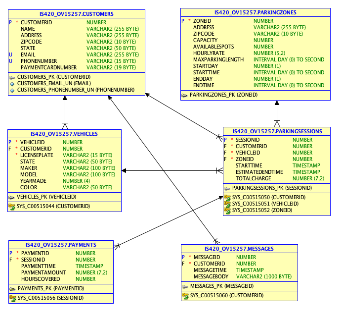

# Parking-Payment-Management-Database

## Project Overview
This project was developed as a final group assignment for the course IS420: Database Application Development. Our team, composed of five members, was tasked with designing and creating a Parking Payment Management Database from scratch. This database is designed to efficiently manage parking fees, vehicle logs, and user accounts.

The purpose of the application is to allow customers to create an entry in the parking management database. They can add their vehicles, and the application will search for free parking zones and start their parking sessions. Customers can also extend or stop their parking sessions. Additionally, the application features an alert system that notifies customers when their parking session is about to expire and asks if they wish to extend it. Finally, the application will generate a report detailing all statistics of a customer's sessions, such as duration and total cost.

## Technologies
* Database: Oracle Database
* Languages: Oracle SQL, PL/SQL
* Tools: Oracle SQL Developer

## Requirements 
We had to design and implement 10 different features. The first 5 features were all individuals and last 5 features, we had to work together to implement them. All of the features had to be implemented using Oracle PL\SQL. The data that we used for the testing were all dummies.

### ER Diagram:

### Features:
1. Creating new customers
2. Adding a customer vehicle
3. Search for a parking zone
4. List all parking sessions in a period for a customer
5. List all vehicles with an active session at a parking zone
6. Start a session
7. Extend a session
8. Stop a session
9. Create a reminder for all sessions
10. Print out all statistics

Details of each feature's designer and implementer can be found in the SQL file. I was responsible for Individual Feature 4, and we worked together to complete the group features.
